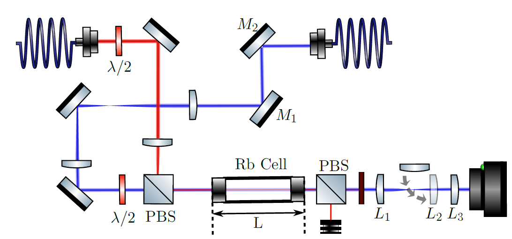

---
title: Test Q
description: 'short description'
position: 3
category: Test Lab

# Defect

  This lab book aims at consigning everything I do about the defect experiment.

## Recap of what I did up until this point 18/02/22

So far I replicated Guillaume's setup 

I added a BS after the first PBS and after the second to allow for both co and counter propagation and to monitor the phase of the fluid at the output.

## Titre 2

Lorem ipsum dolor sit amet vivamus diam senectus tempus netus.

Aenean volutpat curabitur magna eleifend sed senectus est diam nunc in quisque.

Dapibus congue ultricies praesent ultrices facilisis ac lacinia vulputate lectus arcu nibh molestie.

Vulputate magna praesent suspendisse lacus dolore in elit sapien suspendisse.